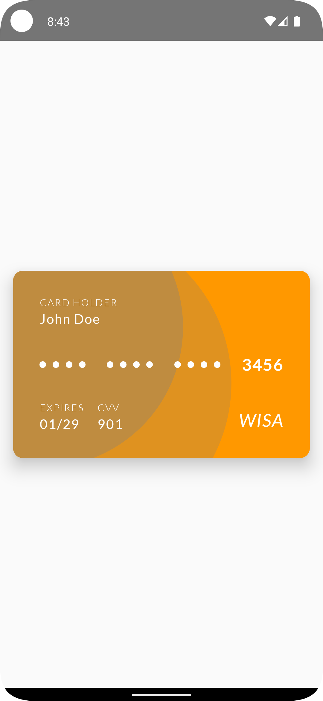

# BankCardUiComposable

  

## Medium Article

This project is accompanied by a Medium article that explains the implementation of the bank card UI in detail. You can read the article [here](https://medium.com/@kenruizinoue/intermediate-android-compose-bank-card-ui-371d14ea7843).

## Overview

The `BankCardUiComposable` project demonstrates the capabilities of Jetpack Compose in building modern, reactive UIs for Android. This project showcases a dynamic bank card interface, leveraging the power of Kotlin and Compose. It's designed as a learning tool for Android developers interested in understanding the nuances of Compose and Kotlin.

## Main Components

The BankCardUi project includes several key Composables that collectively create a realistic bank card interface:

- `BankCardUi`: The main Composable function that orchestrates the layout and appearance of the bank card.
- `BankCardBackground`: A Composable function that handles the dynamic background of the bank card.
- `BankCardNumber` and `BankCardDotGroup`: These Composables display the card number in a stylized format.
- `BankCardLabelAndText`: Used for displaying text information like the cardholder's name and card details.

## Design and Implementation

This project is a testament to the flexibility and efficiency of Jetpack Compose for designing complex UIs. The usage of the Lato font family and the implementation of custom design elements like aspect ratio and color manipulation exemplify intermediate Compose techniques.

## Getting Started

1. Clone the repository to your local machine.
2. Open the project in Android Studio (preferably the latest version for full Compose support).
3. Run the app on an emulator or physical device to see the Composable in action.